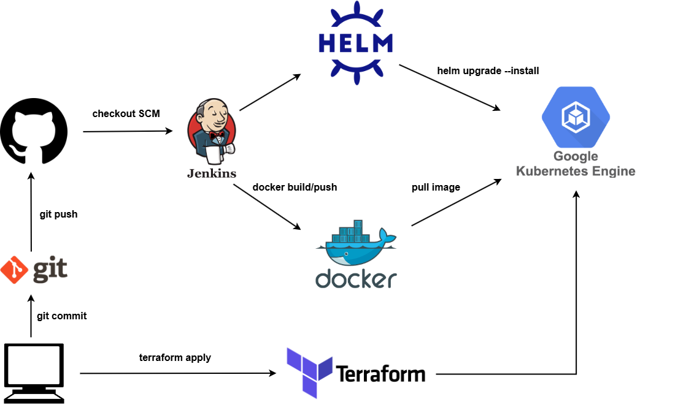

# Deploying Flask application to GKE using Jenkins CI/CD pipeline

## Table of Contents
- [Introduction](#introduction)
- [Project structure](#project-structure)
- [Setup local Git repo](#setup-local-git-repo)
- [Application to be deployed](#application-to-be-deployed)
- [Setting up Jenkins](#setting-up-jenkins)
- [Deploying GKE with Terraform](#deploying-gke-with-terraform)

## Introduction
In this project I will be deploying the **Flask** Trading application, which I have developed, to the **GKE** cluster on GCP. I will pre-build the GKE cluster using **Terraform**. In order to automate the processes of containerizing the application, pushing the image to the DockerHub registry and deploying to GKE I will be using **Jenkins** pipeline. The deployed application will be exposed to the Internet via the K8s LoadBalancer service. For the consistency and simplicity of working with all Kubernetes objects requiered for the application to run I will use **Helm**.

> In this README I will no be covering the code of the application, CI/CD pipeline, Terraform config or Helm chart as it would overload it and will be generally unneseccary as I tried to write meaningful comments on the go. Below, I will only cover the roadblocks which I ran into while setting all stuff up and how I resolved them to compile the working environment

Workflow will be as following:



## Project structure

### Trading application

- app.py
- helpers.py
- ./static
- ./templates

### Terraform configuration

- main.tf
- variables.tf

### Jenkins pipeline

- Jenkinsfile

### Helm chart

```
trading-app-chart/
  Chart.yaml
  values.yaml
  templates/
```

## Setup local Git repo
Since I am using Ubuntu, Git comes pre-installed. Only thing I needed to do was to create a token to be able to authenticate with GitHub and push my code. This is done on GitHub under `Settings` -> `Developer settings` -> `Personal access tokens` -> `Tokens (classic)`.

## Application to be deployed
The application I deploy is built with Flask, which is a Python web microframework, and is essentialy a stocks trading simulator which allows users to create their trading account, charge their account with money, buy and sell company stocks, calculate devidends and access the transactions history. In order to fetch real-time stocks data, application uses free-tier [Tiingo](https://tiingo.com/) REST API. Application depends on the **MySQL** database to store the data such as usernames, passwords, users' stocks and transactions history.

MySQL database has the following schema:

```
CREATE TABLE users (
    id INT AUTO_INCREMENT PRIMARY KEY NOT NULL,
    username VARCHAR(255) NOT NULL,
    hash TEXT NOT NULL,
    cash DECIMAL(10, 2) NOT NULL DEFAULT 10000.00
);

CREATE UNIQUE INDEX username ON users (username);

CREATE TABLE IF NOT EXISTS stocks (
    user_id INT NOT NULL,
    symbol VARCHAR(10) NOT NULL,
    name VARCHAR(255) NOT NULL,
    shares INT NOT NULL,
    FOREIGN KEY(user_id) REFERENCES users(id)
);

CREATE TABLE history (
    user_id INT NOT NULL,
    symbol VARCHAR(10) NOT NULL,
    name VARCHAR(255) NOT NULL,
    shares INT NOT NULL,
    price DECIMAL(10, 2) NOT NULL,
    operation VARCHAR(50) NOT NULL,
    timestamp DATETIME DEFAULT CURRENT_TIMESTAMP,
    FOREIGN KEY(user_id) REFERENCES users(id)
);
```

In `users` table we store the `id`, `username` and the `hash` of a password of each user as well as their current `cash`. `stocks` table stores what and how many shares user posseses. `history` stores the transactions history for each user. Both tables `stocks` and `history` are bound to the `users` table with `user_id` as foreign key. This is how we bind each user in `users` table to the data in `stocks` and `history` ones.

## Setting up Jenkins
I set up Jenkins as a Docker container on my local Ubuntu VM. In order for Jenkins to be able to build containers it needs an access to the Docker runtime. The recommended way for it is to set up Docker-in-Docker container and configure Jenkins container to use it. However, for the home practice, I just mounted the Docker socket from my local Ubuntu host inside the Jenkins container. I also had to change the original Jenkins image to install Docker command line in it.

We also need to install gcloud CLI, Helm and Kubectl inside Jenkins container. Gcloud CLI is needed to authenticate with our GKE cluster and download the Kubeconfig file which will be used by Kubectl and Helm to deploy services. Kubectl depends on `gke-gcloud-auth-plugin` to authenticate with cluster so we install it too. Helm depends on Kubectl and Kubeconfig to install releases.

Dockerfile will look like this:

```
# Start with the latest official Jenkins image
FROM jenkins/jenkins:latest

# Switch to the root user to allow installation of additional packages
USER root

# Update the package lists and install required utilities and certificates
RUN apt-get update -y && apt-get install -y \
    apt-transport-https \ # Allows for secure APT transport
    ca-certificates \     # Provides SSL certificates
    gnupg                # Required for adding GPG keys

# Add Google Cloud SDK repository to the APT sources and install the SDK
RUN echo "deb [signed-by=/usr/share/keyrings/cloud.google.gpg] https://packages.cloud.google.com/apt cloud-sdk main" | tee -a /etc/apt/sources.list.d/google-cloud-sdk.list \
    && curl https://packages.cloud.google.com/apt/doc/apt-key.gpg | gpg --dearmor -o /usr/share/keyrings/cloud.google.gpg \ # Add GPG key for Google Cloud SDK
    && apt-get update -y \ # Update package lists after adding the new repository
    && apt-get install -y google-cloud-cli # Install the Google Cloud CLI

# Install GKE auth plugin, kubectl, and Docker
RUN apt-get update -y && apt-get install -y \
    google-cloud-cli-gke-gcloud-auth-plugin \ # Plugin for GKE authentication
    kubectl \                                # Kubernetes CLI tool
    docker.io                                # Docker runtime

# Download and install Helm
RUN curl -fsSL -o get_helm.sh https://raw.githubusercontent.com/helm/helm/main/scripts/get-helm-3 \ # Download the Helm installation script
    && chmod 700 get_helm.sh \ # Make the script executable
    && ./get_helm.sh           # Run the installation script

# Clean up the Helm installation script after installation
RUN rm ./get_helm.sh

# Remove temporary files and package lists to reduce image size
RUN apt-get clean && rm -rf /var/lib/apt/lists/*

# Switch back to the Jenkins user
USER jenkins
```

And run the container:

```
docker run \
--name jenkins \
-d -p 8080:8080 \
-v /var/run/docker.sock:/var/run/docker.sock \
--group-add $(getent group docker | awk -F : '{ print $3 }') \
--restart unless-stopped \
jenkins
```

Last thing I needed to finish setting up Jenkins was install the GCP service account token as a secret file to the Jenkins credentials. For that, I created the service account on GCP under `IAM & Admin` -> `Service accounts` with `Kubernetes Engine Admin` role. This generated the JSON file which I uploaded as a credential of type secret file to Jenkins.

## Deploying GKE with Terraform
Terraform relies on Application Default Credentials (ADCs) to authenticate against GCP APIs, so as a prerequisite I had to install gcloud CLI on my Ubuntu VM and run `gcloud auth application-default login` which generated the `application_default_credentials.json` file to be used by Terraform to authenticate.

As this is a home project and I wanted to be conscious about free-trial budget, I created a 1-node cluster with 30GB disk running on spot instances. This should be enough, however, to test the deployment.

Since I want my application to be exposed to the Internet, I will need to add a firewall rule to the default VPC that will allow ingress traffic.


